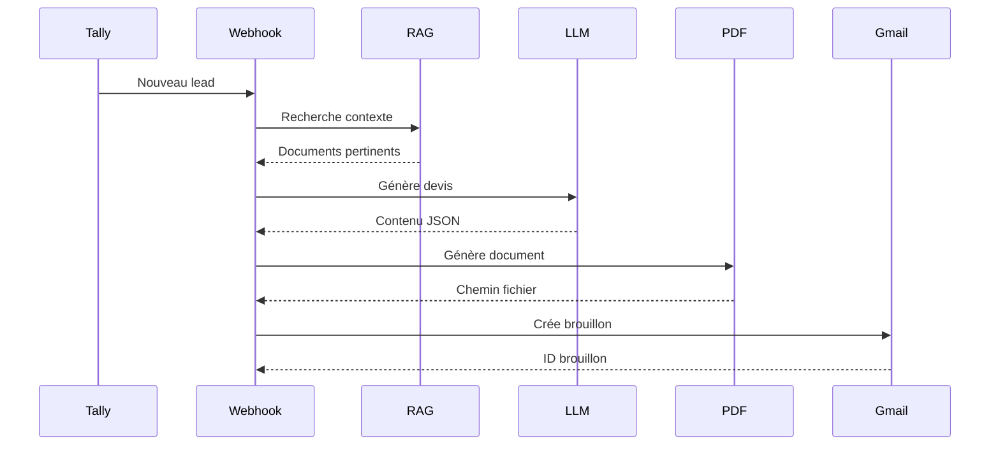

# Agent Juliette 🤖

**Agent IA pour la création et l'envoi automatique de devis** - nana-intelligence.fr

## 🎯 Fonctionnalités

- **📥 Réception des leads** via webhook Tally
- **🔍 Recherche RAG** dans une base de connaissances Qdrant
- **🤖 Génération IA** de devis personnalisés via OpenAI (GPT-5/GPT-4o)
- **📄 Création de PDF** professionnels avec ReportLab
- **📧 Brouillons Gmail** avec pièce jointe PDF

## 🏗️ Architecture

```
agent_juliette/
├── main.py                    # API FastAPI (webhooks, endpoints)
├── src/
│   ├── config.py              # Configuration (Pydantic Settings)
│   ├── models.py              # Modèles de données
│   ├── agent/
│   │   ├── prompts.py         # Prompts par spécialité
│   │   ├── devis_generator.py # Génération de devis (RAG + LLM)
│   │   ├── pdf_service.py     # Génération de PDF
│   │   └── orchestrator.py    # Orchestration du flux complet
│   └── integrations/
│       ├── tally.py           # Modèles webhook Tally
│       ├── tally_service.py   # Parsing Tally → LeadRequest
│       ├── openai_service.py  # Embeddings & completions
│       ├── qdrant_service.py  # Recherche vectorielle
│       └── gmail_service.py   # API Gmail OAuth2
├── tests/                     # Tests unitaires
├── generated_pdfs/            # PDFs générés
└── .env                       # Configuration locale
```

## 🚀 Installation

### Prérequis

- Python 3.12+
- [uv](https://docs.astral.sh/uv/) (gestionnaire de packages)

### Installation

```bash
# Cloner le projet
cd agent_juliette

# Installer les dépendances
uv sync

# Copier la configuration
cp .env.example .env
# Éditer .env avec vos clés API
```

## ⚙️ Configuration

Créez un fichier `.env` avec les variables suivantes :

```env
# OpenAI
OPENAI_API_KEY=sk-proj-...
OPENAI_MODEL=gpt-5-nano  # ou gpt-4o

# Qdrant - Base vectorielle
QDRANT_URL=https://xxx.cloud.qdrant.io
QDRANT_API_KEY=xxx
QDRANT_COLLECTION_NAME=nana_intelligence_knowledge

# Gmail OAuth2 (optionnel)
GMAIL_CREDENTIALS_PATH=./credentials.json
GMAIL_TOKEN_PATH=./token.json
GMAIL_SENDER_EMAIL=votre-email@gmail.com

# Application
APP_ENV=development
LOG_LEVEL=INFO
```

### Configuration Gmail

1. Créez un projet sur [Google Cloud Console](https://console.cloud.google.com/)
2. Activez l'API Gmail
3. Créez des identifiants OAuth2 (type "Application de bureau")
4. Téléchargez le fichier `credentials.json`
5. Placez-le à la racine du projet

## 🏃 Lancer l'application

```bash
# Développement avec hot-reload
uv run uvicorn main:app --reload

# Production
uv run uvicorn main:app --host 0.0.0.0 --port 8000
```

## 🔌 Endpoints API

### Health Check

```http
GET /health
```

### Webhook Tally

```http
POST /webhook/tally
Content-Type: application/json

# Reçoit les soumissions du formulaire Tally
# Déclenche automatiquement le flux complet
```

### Informations RAG

```http
GET /rag/info

# Retourne les infos sur la collection Qdrant
```

### Recherche RAG

```http
GET /rag/search?query=automatisation&limit=3

# Teste la recherche dans la base de connaissances
```

### Test génération devis

```http
POST /agent/test-devis
Content-Type: application/json

{
    "first_name": "Jean",
    "last_name": "Dupont",
    "email": "jean@example.com",
    "company": "Ma Société",
    "service_type": "automation_ia",
    "project_description": "Automatiser mes processus...",
    "budget_range": "1-3k€"
}
```

### Test génération PDF

```http
POST /agent/test-pdf
Content-Type: application/json

# Pareil que /agent/test-devis mais génère aussi le PDF
```

## 📨 Configuration Tally

Dans Tally, configurez un webhook vers :

```
https://votre-domaine.com/webhook/tally
```

### Champs du formulaire attendus :

- **Prénom** (texte)
- **Nom** (texte)
- **Email Pro** (email)
- **Nom de votre entreprise** (texte, optionnel)
- **Site web** (url, optionnel)
- **Type de service** (sélection : Mass Mailing, Automation & IA, SEO & Growth)
- **Description du besoin** (texte long)
- **Budget indicatif** (sélection, optionnel)
- **Consentement RGPD** (checkbox)

## 🧪 Tests

```bash
# Lancer tous les tests
uv run pytest

# Avec couverture
uv run pytest --cov=src

# Test spécifique
uv run pytest tests/test_tally.py -v
```

## 📊 Types de services

| Service         | Description                                    |
| --------------- | ---------------------------------------------- |
| `mass_mailing`  | Campagnes email, cold emailing, scraping leads |
| `automation_ia` | Workflows n8n/Make, agents IA, chatbots        |
| `seo_growth`    | Audit SEO, contenu optimisé, backlinks         |

## 🔄 Flux de traitement



## 📝 Exemple de réponse webhook

```json
{
  "success": true,
  "message": "Devis DEV-20260201-ABC12345 créé avec succès",
  "lead_reference": "tally_id_xxx",
  "data": {
    "devis_reference": "DEV-20260201-ABC12345",
    "pdf_path": "/path/to/DEV-20260201-ABC12345.pdf",
    "draft_id": "gmail_draft_xxx",
    "total_ttc": 3600.0,
    "processing_time_ms": 15234
  }
}
```

## 🛠️ Développement

### Linting

```bash
uv run ruff check .
uv run ruff format .
```

### Structure des commits

- `feat:` Nouvelle fonctionnalité
- `fix:` Correction de bug
- `docs:` Documentation
- `refactor:` Refactoring

## 📄 Licence

Propriétaire - nana-intelligence.fr

---

**Développé avec ❤️ par nana-intelligence**
